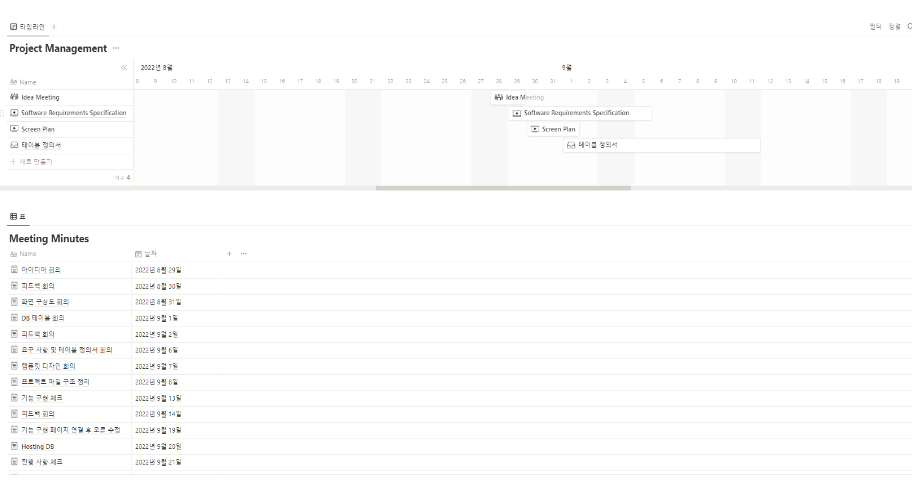
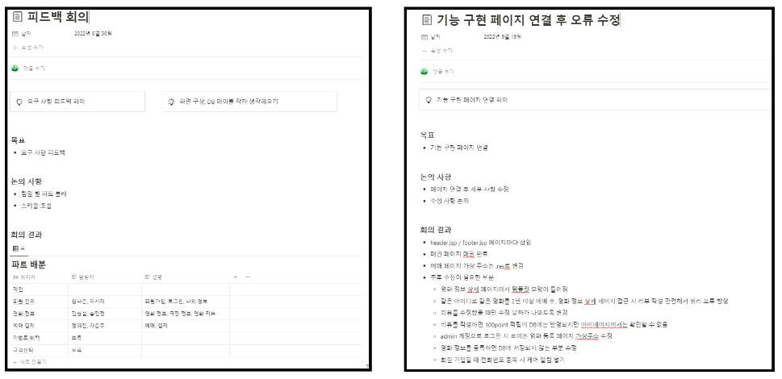

1. 팀원소개 
    📌 김나은 : 회원정보수정 및 회원탈퇴와 마이페이지 기능 구현(JSP) / 화면 구성 및 홈페이지 제작 (HTML/CSS/JS) / 최종 수정본 취합 / 템플릿 코드와 기능 구현 코드 연결 
    📌 팀원 A : 관리자 페이지 제작 / 깃 관리 연동 / 한줄평 작성과 수정기능 구현 /  프로젝트 시연 및 발표  
    📌 팀리더 : 프로젝트 일정관리 및 카페 24 호스팅 / 코드 전체 연결 / 메인페이지 기능 및 영화정보페이지 기능 구현, 헤더와 푸터 부분 기능 구현 / 테이블설계 및 요구명세서 최종정리  
    📌 팀원 B : SQL 쿼리 작성 / 회원가입, 로그인 및 로그아웃 기능 구현 / 마이페이지 내 각종 내역 기능 구현 / PPT 제작 
    📌 팀원 C : 예매기능 구현 → 인원/좌석 선택 기능 / 싱크로나이즈를 통해 이미 예매된 좌석을 중복으로 예매할 수 없도록 구현 / 결제 완료 후 예매 정보 DB 연동 / 결제 API 연결 
    📌 팀원 D : DB 데이터 삽입 / 예매기능 구현 → 영화 선택 후 날짜, 시간 선택 기능 / 비회원은 예매할 수 없도록 제어 / SNS 관리 및 연동 / 발표 대본 작성 
 
 
2. 프로젝트 소개 
    📌 기획의도: 독자적인 영화 예매 및 결제 서비스를 구축하여 고객들의 관심에 알맞은 영화 정보를 제공한다. 기존의 복잡한 영화예매사이트와 달리 직관적인 UI를 통해 다양한 연령층의 접근성을 최대화한다. 
    📌 개발일정 : 2022.08.29 ~ 2022.09.30  
        
     
    📌 1주차 ⇒ 아이디어 회의 / 자료 수집 / 요구사항 분석 및 설계, 요구사항 정의서 작성 / DB 테이블 설계 및 작성 
    📌 2주차 ⇒ 1주차 회의 후 피드백 취합 / 화면 구성 및 템플릿 디자인 회의 / 화면 구조 정리 
    📌 3주차 ⇒ 회원, 영화 ,예매 및 결제 피드백 구현 / DB 호스팅 작업 
    📌 4주차 ⇒ 영화 예매 사이트 구현 (기능) / 페이지 연결 및 오류 수정 / 템플릿 제작 시작 
    📌 5주차 ⇒ 페이지 연결 및 오류 수정 / 발표 자료 작성 및 시연 연습 / 템플릿 최종 수정 
 
 
3. 회의록 

    
    
    
    
    

   

 
4. 개발환경 소개 
   개발언어  
   

 
5. 설계 단계 소개 
    📌 요구사항 분석 및 설계 
        1. 메인화면 
        1️⃣ 로그인/회원가입/예매 페이지 이동 
        2️⃣ 개봉 영화 예고편 영상 (유튜브 연동 / 예매율을 기준으로 가장 높은 순위에 해당하는 영화 예고편을 띄움) 
        3️⃣ 예매율순으로 포스터 출력 
        4️⃣ 푸터 부분에 영화관 공식 인스타그램, 블로그 연결 
        2. 회원가입 
        1️⃣ 회원가입에 필요한 정보 입력 받기  
        2️⃣ 아이디 중복 확인 및 이용약관 동의 제어 
        3. 로그인 
        1️⃣ 아이디, 비밀번호 입력 후 로그인 
        2️⃣ 로그인 후 사용자 정보 상단 출력  
        3️⃣ 로그인 후 일반 사용자 / 관리자 구분하여 접근 가능 메뉴 제어 
        4. 영화정보 
        1️⃣ 현재상영작 / 개봉예정작과 장르별로 버튼 3개로 나누어 구분지어 정렬 조회 가능 
        2️⃣ 포스터 클릭 시 영화정보 상세 페이지로 이동 → ‘예매하기’ 버튼과 ‘목록’ 버튼으로 바로 예매페이지로 이동할 수 있고, 이전 영화 목록이 나열되어 있는 곳으로 이동할 수 있는 버튼 존재 
        3️⃣ 영화 한줄평 작성 및 수정, 조회 가능  
        5. 영화정보 등록 
        1️⃣ 관리자 계정으로 로그인 시 일반 사용자와는 다르게 영화정보 등록 버튼이 존재 
        2️⃣ 영화제목, 줄거리 등 기본적인 필요 정보 필수적으로 기입해야하고 , 누락된 부분이 있을 시 alert창 띄워줌. 
        6. 영화리뷰 
        1️⃣ 영화정보 상세페이지에서 해당 영화에 해당하는 한줄평 조회 및 작성, 수정 가능 
        2️⃣ 사용자의 예매내역을 바탕으로 한줄평을 작성할 수 있으므로 예매한 기록이 없는 사용자는 권한이 없으므로 작성 및 수정할 수 없고 조회만 할 수 있음 
        3️⃣ 리뷰 작성 시 포인트 100원 적립 (최초 1회 작성 시 적립) → 포인트 중복 적립에 관한 문제로 리뷰 삭제 기능은 구현하지 않음. 
        7. 예매/결제  
        1️⃣ 영화, 상영날짜, 상여시간, 관람인원, 좌석 등 선택 후 예매 
        2️⃣ 예약된 좌석일 경우 재선택하도록 제어 
        3️⃣ 결제 금액 확인 후 결제 진행 , 결제 API로 결제수단 선택 페이지는 삭제함 
        4️⃣ 결제 중 일정시간 경과 시 이전 페이지로 돌아감 
        8. 마이페이지 
        1️⃣ 회원정보수정 및 탈퇴 가능 
        2️⃣ 예매내역, 리뷰작성내역 , 포인트내역 조회가능 
    📌 테이블 정의서 

        
    📌 ERD 다이어그램 ⇒ 총 6개의 테이블 설계 
